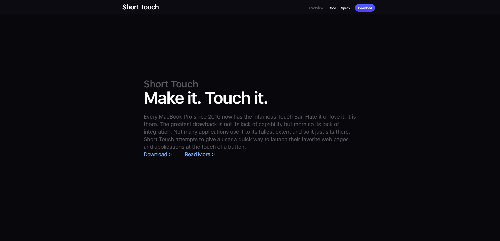
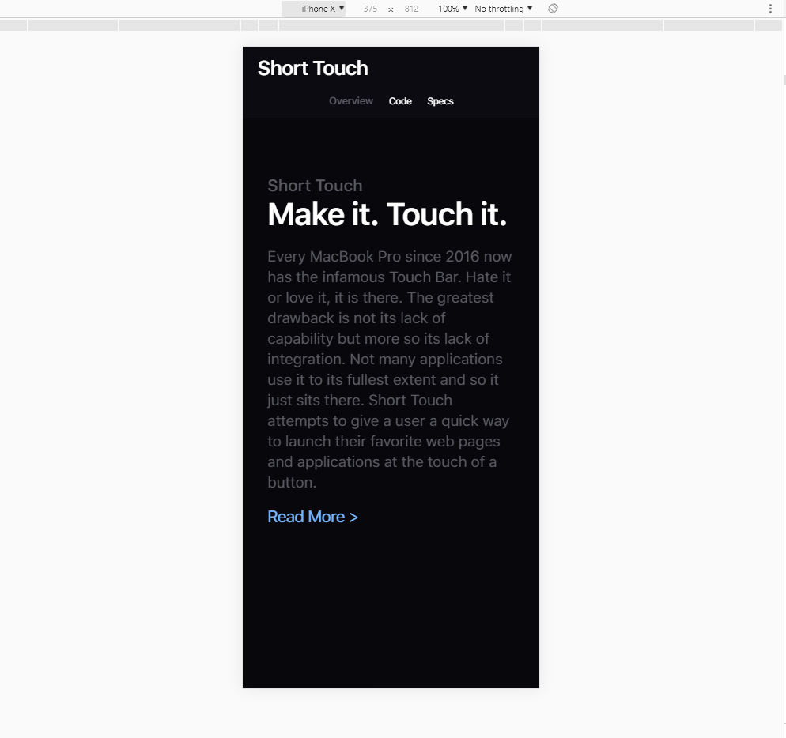

# Short Touch Website 

> Code for the application I made.

## Todo List

[x] Get initial styling down

[x] Deploy to Heroku

[x] Responsive styling for tablet and mobile

[ ] Add more content

## Inspired by

- [Caprine](https://github.com/sindresorhus/caprine) by [Sindre Sorhus](https://github.com/sindresorhus)
